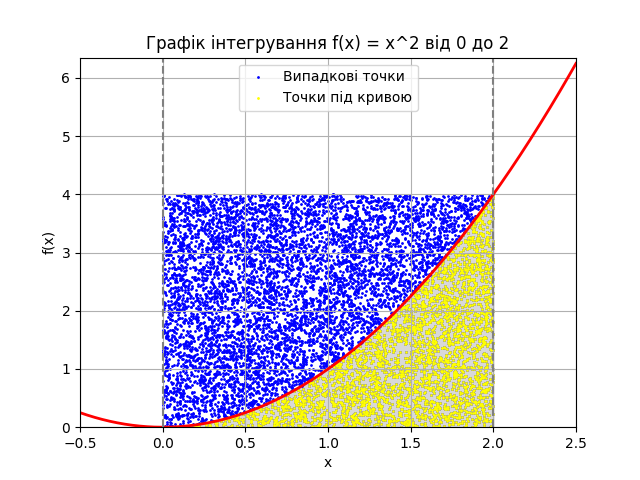

# Висновок

Обчислення інтегралу функції методом Монте-Карло показало наступні результати:

```
Метод          Результат                Похибка
=================================================================
Монте-Карло    3.600000                 0.933333
Аналітичний    2.666667                 0.000000

Кількість випадкових точок: 100

None
Метод          Результат                Похибка
=================================================================
Монте-Карло    2.680000                 0.013333
Аналітичний    2.666667                 0.000000

Кількість випадкових точок: 1000

None
Метод          Результат                Похибка
=================================================================
Монте-Карло    2.684800                 0.018133
Аналітичний    2.666667                 0.000000

Кількість випадкових точок: 10000

None
Метод          Результат                Похибка
=================================================================
Монте-Карло    2.663600                 0.003067
Аналітичний    2.666667                 0.000000

Кількість випадкових точок: 100000

```
Графік, який ілюструє метод Монте-Карло, наведено нижче:



Зазначена різниця між результатами виникає через природу кожного методу обчислення інтегралу. 
Метод Монте-Карло базується на випадковому виборі точок у просторі і оцінює значення інтегралу
шляхом вимірювання відсотка точок, що потрапляють під криву, відносно загальної кількості випадкових 
точок. З іншого боку, функція quad використовує чисельні методи для точного обчислення значення інтегралу. 
Як видно з результатів, метод Монте-Карло дає результат близький до аналітичного, але з певною похибкою, 
яка зменшується при збільшенні кількості випадкових точок.
